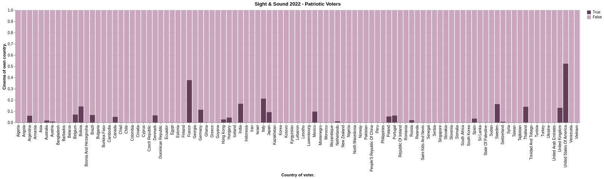

# Sight & Sound 2022

Data visualisation concerning voter data from the 2022 Sight & Sound poll, federated with Wikidata. Note that the current matching algorithm relies on filmographic fingerprinting, so naturally favours directors with multiple entries in the poll. Better would be a linking file between the two resources.

### Patriotic Voters

Prevalence of voters voting for films of their own country. Note that where voter and/or film are attributed to multiple countries, any crossover is accepted.

